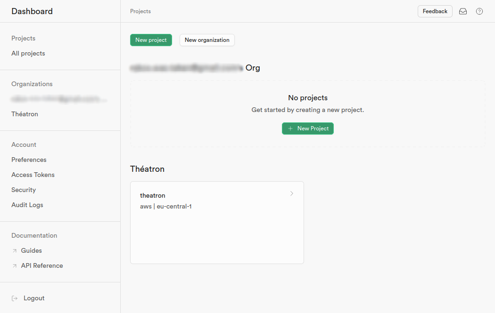
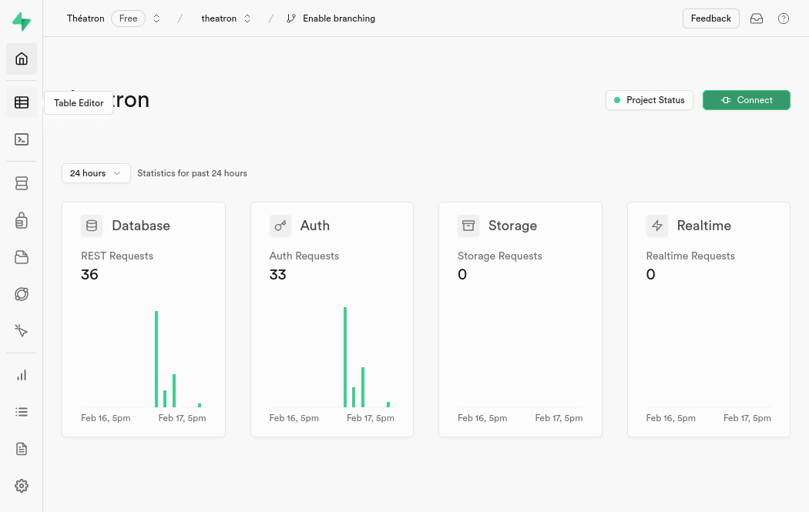
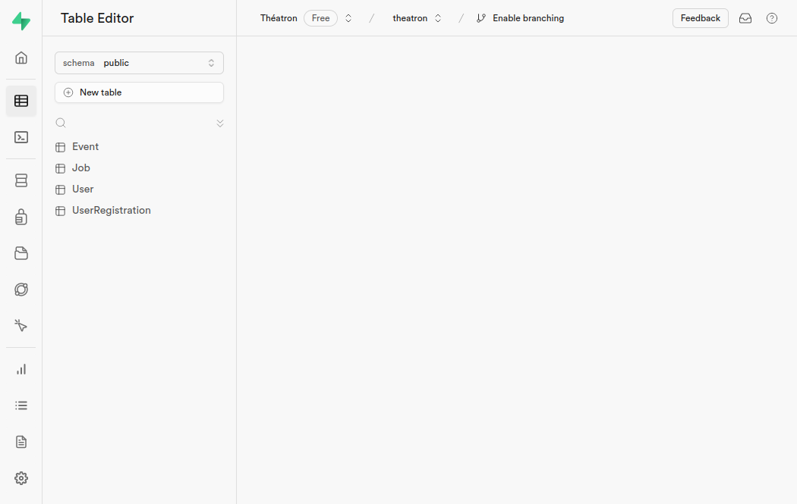
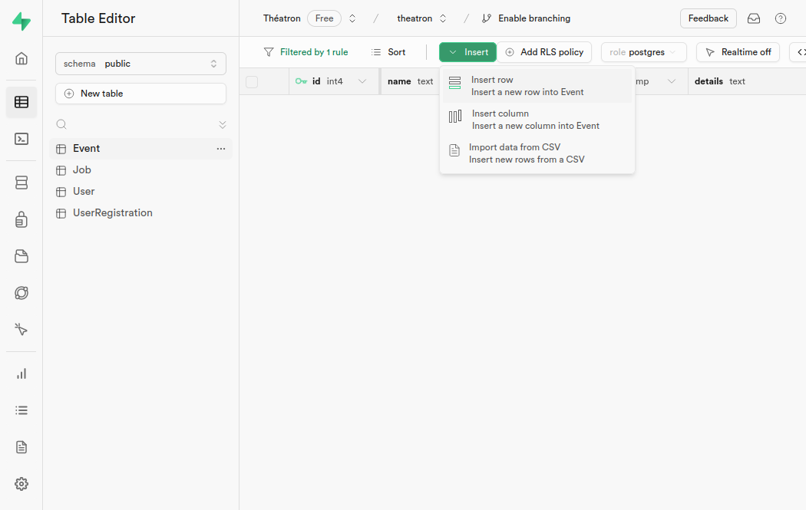
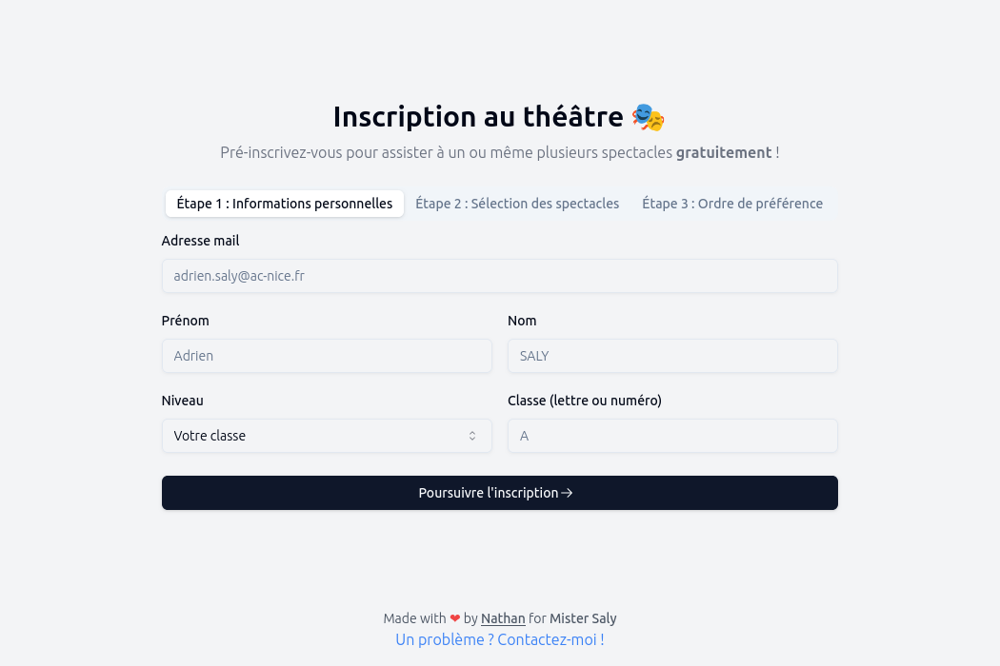
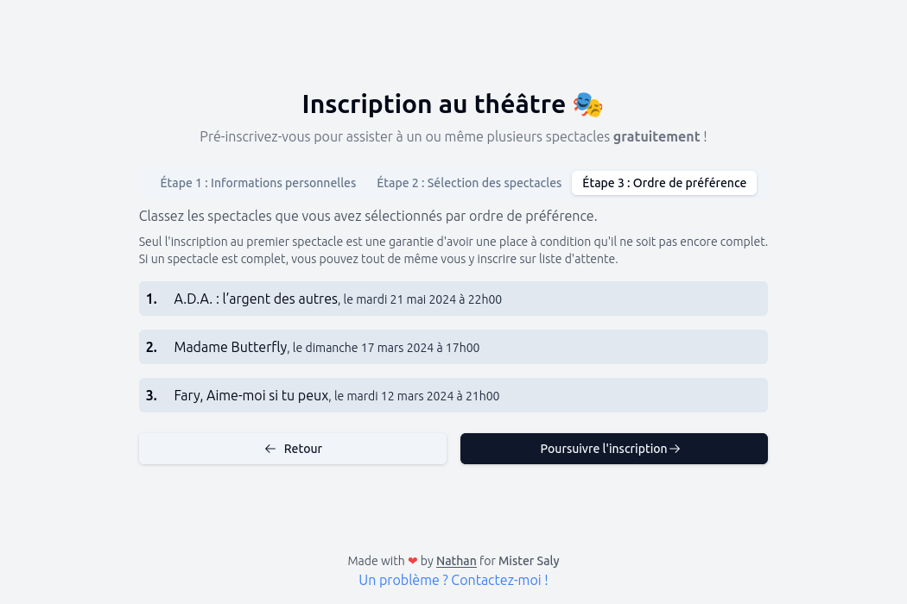
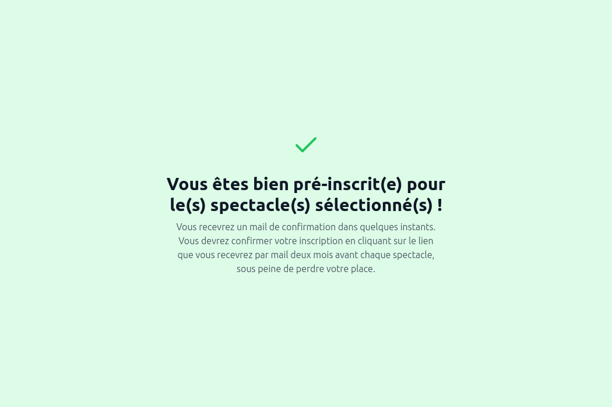
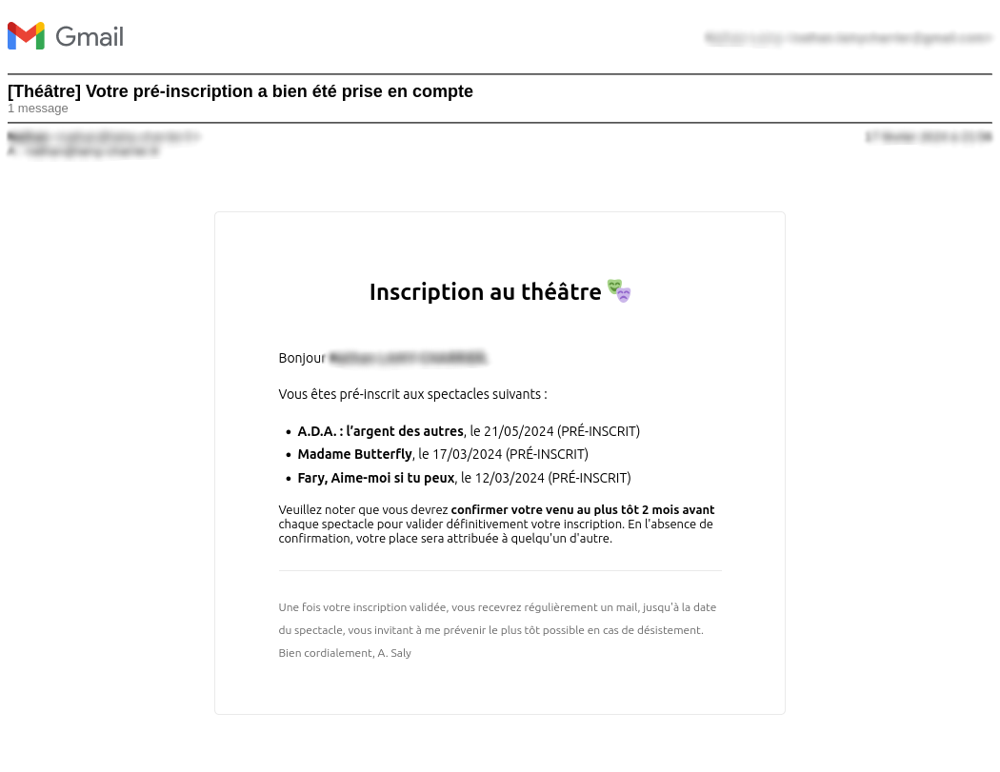

# Théatron

## Introduction

Une plateforme tout-en-un pour la gestion des inscriptions au théâtre, avec confirmations automatiques, rappels, désistements, et listes d'attente simplifiées 🎭

Fait avec [Bun](https://bun.sh/), [Elysia](https://elysiajs.com/) [Supabase](https://supabase.com/), [Tailwind CSS](https://tailwindcss.com/), et [Vite](https://vitejs.dev/).

Fait dans le cadre des lycéens au théâtre, pour le lycée Simone Veil afin de faciliter la gestion des inscriptions et des rappels pour les spectacles ainsi que de permettre à un maximum de personnes de profiter des spectacles.

## Accès à l'administration (Supabase)

Pour accéder à l'administration, il suffit de se rendre sur le projet Supabase et de se connecter avec les identifiants fournis.

Vous pouvez ensuite choisir le projet `Théatron` sur la page d'accueil de Supabase.

Vous pourrez alors accéder à la base de données en cliquant sur la deuxième icône en partant du haut dans la barre latérale à gauche : `Table Editor`.

Vous pourrez alors voir les différentes tables de la base de données, et les modifier si besoin.

## Création d'un spectacle

Pour créer un spectacle, il suffit de se rendre sur la page d'administration Supabase et de choisir la table `Event`. Il suffit ensuite de cliquer sur `Insert` puis `Insert row` pour ajouter un spectacle.

Il est possible de renseigner :

- Le nom du spectacle (`name`)
- La date du spectacle (`date`)
- Les détails du spectacle (`details`) par exemple l'heure du rendez-vous "(rendez-vous à 19h30)"
- Le nombre de places disponibles (`capacity`)

**⚠️ Attention :** Le premier champ `id` est automatiquement généré par Supabase et ne doit pas être renseigné !

**⚠️ Attention :** Le dernier champ `closed` est automatiquement mis à `false` et ne doit pas être changé ! Un spectacle est fermé automatiquement deux mois avant sa date lorsque les places sont affectées. Si un élève s'inscrit après la fermeture, il est automatiquement mis sur liste d'attente si le spectacle est complet ou sur liste d'inscription si des places sont disponibles.

## Inscriptions

Pour s'inscrire à un spectacle, il suffit de se rendre sur la page d'inscription `/register`.

Dans un premier temps, il faut renseigner l'adresse mail, le nom et le prénom de l'élève, ainsi que sa classe.

Ensuite, il suffit de choisir le(s) spectacle(s) au(x)quel(s) l'élève souhaite s'inscrire.

Enfin, il faut les classer par ordre de préférence. Si un spectacle est complet, l'élève sera automatiquement mis sur liste d'attente.

L'élève sera alors redirigé vers une page de succès, et recevra un mail de confirmation.

**Remarque :** Seul le spectacle mis en **première position garantit une place**. Les autres spectacles sont des choix secondaires. Si l'élève est sur liste d'attente pour le premier spectacle, il sera automatiquement inscrit au deuxième spectacle s'il est disponible et ainsi de suite. De cette manière, chaque élève est assuré d'avoir une place pour un spectacle (sauf si tous les spectacles sont complets, auquel cas il sera automatiquement mis sur liste d'attente pour le premier spectacle).

_Exception à ce qui précède : Afin de compléter les spectacles, si un élève s'inscrit à un spectacle qui est fermé (c'est à dire dans deux mois ou moins) et qu'il reste des places, il sera automatiquement inscrit à ce spectacle ainsi qu'à son premier choix._

**Remarque :** Les inscriptions pour chaque spectacle sont fermées automatiquement **trois jours** avant la date du spectacle.

**⚠️ Attention :** Chaque élève, représenté par son adresse mail, ne peut s'inscrire qu'une seule fois. Si il tente de s'inscrire une deuxième fois, il sera automatiquement redirigé vers une page d'erreur.

